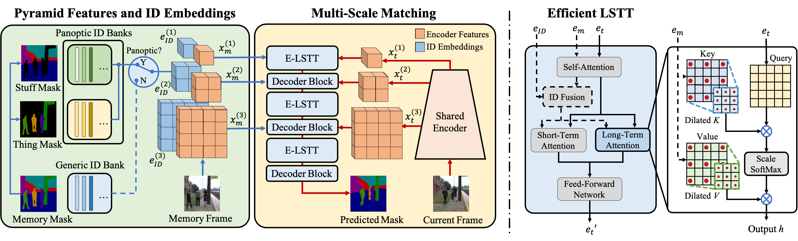

# Pyramid/Panoptic AOT

## Introduction
The code for the pyramid AOT and panoptic AOT is released in this paot branch.

In the paper ["Video Object Segmentation in Panoptic Wild Scenes"](https://arxiv.org/abs/2305.04470), the benchmark [VIPOSeg](https://github.com/yoxu515/VIPOSeg-Benchmark) for panoptic VOS is proposed, and panoptic AOT is designed to tackle the challenges in panoptic scenes. Please check out the [benchmark](https://github.com/yoxu515/VIPOSeg-Benchmark) and the paper for further details.

### Pyramid AOT (PAOT)
- Pyramid AOT (or Multi-scale AOT) is for classic semi-supervised VOS setting.
- Winner in 2022 VOT challenge short-term and real-time tracks.
- A pyramid architecture is equipped, merging the transformer blocks with the decoder for sequential multi-scale feature matching.
### Panoptic AOT (PAOT Pano-ID)
- Panoptic AOT is for panoptic VOS setting.
- SOTA performance on our panoptic VOS benchmark [VIPOSeg](https://github.com/yoxu515/VIPOSeg-Benchmark).
- Beside the pyramid architecture, Panoptic AOT uses separate ID banks for thing object and stuff object identification (Pano-ID).



## Requirements
Please follow the instruction of the main branch.

## Model Zoo and Results
|         Model        | Param (M) |                                              PRE                                             |                                            PRE_VIP                                           |                                          PRE_YTB_DAV                                         |                                        PRE_YTB_DAV_VIP                                       |
|:--------------------:|:---------:|:--------------------------------------------------------------------------------------------:|:--------------------------------------------------------------------------------------------:|:--------------------------------------------------------------------------------------------:|:--------------------------------------------------------------------------------------------:|
| R50-PAOT             |     22    | [gdrive](https://drive.google.com/file/d/1IIkeBV6t4Iei3r4tJNKqu---gAHOCurn/view?usp=sharing) | [gdrive](https://drive.google.com/file/d/1uG5BhUiF-pkv5tk8tpEIxEY_bqAgjpeO/view?usp=sharing) | [gdrive](https://drive.google.com/file/d/1owKz8uS5lEiOH0j4fPtNaOUrirwYYECK/view?usp=sharing) | [gdrive](https://drive.google.com/file/d/1i10dOe4lFJFqkI3hlCbpL4G4EfTzXUnG/view?usp=sharing) |
| R50-PAOT (Pano-ID)   |     29    | [gdrive](https://drive.google.com/file/d/1IIkeBV6t4Iei3r4tJNKqu---gAHOCurn/view?usp=sharing) | [gdrive](https://drive.google.com/file/d/1nr4vqCT2hiKYY4nbtqLVfT7YJm5Nrm9R/view?usp=sharing) |                                               -                                              |                                               -                                              |
| SwinB-PAOT           |     83    | [gdrive](https://drive.google.com/file/d/1po5xq9rXvsMgPeOUIAdo0GkbFy2InivQ/view?usp=sharing) | [gdrive](https://drive.google.com/file/d/1SIUSMrl-32JABD50YJhaUHAZ4PAAfCWw/view?usp=sharing) | [gdrive](https://drive.google.com/file/d/1bDkpJvvVDcY8WPY_rMKB38Nnl47-YSf_/view?usp=sharing) | [gdrive](https://drive.google.com/file/d/15is7qL1B6Jq-WmsjrguVjD_fRXUkGMQE/view?usp=sharing) |
| SwinB-PAOT (Pano-ID) |     90    | [gdrive](https://drive.google.com/file/d/1po5xq9rXvsMgPeOUIAdo0GkbFy2InivQ/view?usp=sharing) | [gdrive](https://drive.google.com/file/d/13UeivN3Sc0uBy3LV-96XL9WN5RQ7HLEu/view?usp=sharing) |                                               -                                              |                                               -                                              |

| VIPOSeg Results |                                               PRE_VIP                                              |                                             PRE_YTB_DAV                                            |                                           PRE_YTB_DAV_VIP                                          |
|:---------------------:|:--------------------------------------------------------------------------------------------------:|:--------------------------------------------------------------------------------------------------:|:--------------------------------------------------------------------------------------------------:|
| R50-PAOT              | 77.5, [gdrive](https://drive.google.com/file/d/1ddm06bbJhMewn5_bbxyarscG9C3tqHbs/view?usp=sharing) | 75.4, [gdrive](https://drive.google.com/file/d/1j2wxoHM1rGG4674-rfsB_NnbhWImFD9D/view?usp=sharing) | 77.4, [gdrive](https://drive.google.com/file/d/1Mrmj9FNOmke9vRL2Pn-c5r96zEvl580R/view?usp=sharing) |
| R50-PAOT (Pano-ID)    | 77.9, [gdrive](https://drive.google.com/file/d/1nx66DN8RxVH8xEWakwDvPI-BpMWt8XBF/view?usp=sharing) |                                                  -                                                 |                                                  -                                                 |
| SwinB-PAOT            | 78.0, [gdrive](https://drive.google.com/file/d/1Uo4yP2_mvVUZesSaDGhMlmLJS9ki1NvZ/view?usp=sharing) | 75.3, [gdrive](https://drive.google.com/file/d/1QYLVp-yGdsd_oDLP7QBiauOV1cjlMCPI/view?usp=sharing) | 77.9, [gdrive](https://drive.google.com/file/d/1LrpwJbNd0R8WgGwQyt5aiZT0w0Y9JUyQ/view?usp=sharing) |
| SwinB-PAOT (Pano-ID)  | 78.2, [gdrive](https://drive.google.com/file/d/1Aq9MJzooGaZYoD7uT_O6an7xTkF4VKbA/view?usp=sharing) |                                                  -                                                 |                                                  -                                                 |

## Getting Started
Please follow the commonds in "train.sh" and "eval.sh" for training and evaluation. In the implementation, the model name "AOTv3" is for Pyramid AOT, and "PAOT" is for Panoptic AOT with Pano-ID. Choose different config for your purpose:

Model configs for Pyramid AOT (classic VOS setting):
- "configs/ms_r50_\*.py" and "configs/ms_swinb_\*.py" are for different pyramid AOT models with ResNet50 and Swin-Base backbone.
- "v" stands for using VIPOSeg for main training. "yd" stands for YouTube-VOS and DAVIS for main training. "ydv" stands for VIPOSeg, YouTube-VOS and DAVIS for joint training.

Model configs for Panoptic AOT (panoptic VOS setting):
- Download the VIPOSeg dataset and put it in the "./datasets" folder.
- "configs/pano_r50.py" and "configs/pano_swinb.py" are for different panoptic AOT models with ResNet50 and Swin-Base backbone.


## Notes
The organization of this branch is similar to the main branch but there are a few differences in detail.
- Thin plane spline (TPS) augmentation is used in pre-training, which may cause slow training. Set DATA_TPS_PROB=0 in the config to disable.
- Panoptic AOT requires the thing/stuff annotation for each object.
- Panoptic AOT and Pyramid AOT share the same model for pre-training stage.
- Training PAOT with Swin-Base backbone requires high GPU memory > 30G.

## Citations
```
@article{xu2023video,
  title={Video Object Segmentation in Panoptic Wild Scenes},
  author={Xu, Yuanyou and Yang, Zongxin and Yang, Yi},
  journal={arXiv preprint arXiv:2305.04470},
  year={2023}
}
@inproceedings{yang2022deaot,
  title={Decoupling Features in Hierarchical Propagation for Video Object Segmentation},
  author={Yang, Zongxin and Yang, Yi},
  booktitle={Advances in Neural Information Processing Systems (NeurIPS)},
  year={2022}
}
@article{yang2021aost,
  title={Scalable Multi-object Identification for Video Object Segmentation},
  author={Yang, Zongxin and Miao, Jiaxu and Wang, Xiaohan and Wei, Yunchao and Yang, Yi},
  journal={arXiv preprint arXiv:2203.11442},
  year={2022}
}
@inproceedings{yang2021aot,
  title={Associating Objects with Transformers for Video Object Segmentation},
  author={Yang, Zongxin and Wei, Yunchao and Yang, Yi},
  booktitle={Advances in Neural Information Processing Systems (NeurIPS)},
  year={2021}
}
```